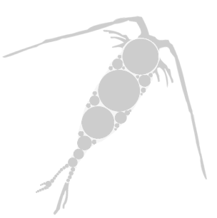

### <div style="clear: both;">  <font size= “1”>Machine learning models applied to the Pelagic Size Structure database ([PSSdb](https://pssdb.net/ ""))</font></div>  
###### Mathilde Dugenne, Jessica Luo, Rainer Kiko, Marco Corrales-Ugalde, Todd O'Brien, Charles Stock, Jean-Olivier Irisson, Lars Stemmann, Fabien Lombard
<a href="mailto:contact@pssdb.net">Contact us</a>

This repository includes the code to model plankton spectral biogeography using the Pelagic Size Structure database taxa-specific products and the machine learning model xgboost.

Acknowledgment: This work is funded by NOAA (Award #NA21OAR4310254)

<div id="organisation">
<details>
  <summary>Organisation</summary>
<font size="2">
This repository contains a:

* <a href="https://github.com/mdugenne/PSSdb_Learning/tree/main/scripts/Configuration_masterfile_template.yaml"><span class="link"></span>configuration masterfile</a>: File used to configure this GitHub repository.
This file contains the credentials information needed to download environmental variables from NASA, Copernicus, or AVISO

<font size="2">
Attention: The repository includes a <a href="https://github.com/mdugenne/PSSdb_Learning/tree/main/.gitignore"><span class="link"></span>gitignore file</a>, which is used to protect personal information or avoid tracking datafiles that exceed the limit for GitHub upload (2Gb). Personal information, login and password, are required to download datasets hosted on <a href="https://ecotaxa.obs-vlfr.fr"><span class="link"></span>EcoTaxa</a>, <a href="https://oceandata.sci.gsfc.nasa.gov/directdataaccess/Level-3%20Mapped/Aqua-MODIS"><span class="link"></span>NASA</a>, <a href="https://data.marine.copernicus.eu/products"><span class="link"></span>Copernicus</a>, or  <a href="https://www.aviso.altimetry.fr/en/home.html"><span class="link"></span>AVISO</a>. 
Read instructions of the template configuration masterfile to save these protected information in a "configuration_masterfile.yaml" file.
</font>

* <a href="https://github.com/mdugenne/PSSdb_Learning/tree/main/scripts"><span class="link"></span>scripts</a> section: contains all scripts and functions developed for PSSdb_Learning. This section includes functions required at each step of the [Workflow](#workflow), paired with a numbered script, whose objective is to generate global predictions of taxa-specific Normalized Biovolume Size Spectrum using PSSdb data products (see <a href="https://pssdb.net"><span class="link"></span>PSSdb website</a>).
Numbered scripts should be run sequentially in order to generate the final PSSdb_Learning products.


* <a href="https://github.com/mdugenne/PSSdb_Learning/tree/main/data"><span class="link"></span>data</a> section: contains all datafiles, including PSSdb taxa-specific products (NBSS_ver_xx_xxxx), environmental factors (Environement, not tracked since files are too large), and model predictions (Model_output).

  

* <a href="https://github.com/mdugenne/PSSdb_Learning/tree/main/figures"><span class="link"></span>figures</a> section: contains all figures generated for the associated paper.


</font>
</details>

</div>

<div id="workflow">


<details>
  <summary>Workflow</summary>
<font size="2" style="line-height:0.2em">
<br>The workflow includes four steps (numbered 0 to 3) that should be run sequentially to train boosted decision trees and predict taxa-specifc NBSS parameters globally.</font>


<details>
  <summary>Pre-steps: Generate taxa-specific products in PSSdb</summary><blockquote>
<font size="2">
</font>

Taxa-specific Normalized Biovolume Size Spectra (NBSS) are automatically generated by the <a href="https://github.com/jessluo/PSSdb"><span class="link"></span>PSSdb</a> pipeline.
First, imaging datasets are downloaded automatically from the platform for automated classification and manual validation EcoTaxa.

Second, datafiles are standardized according to standard formats and units, and taxonomic annotations are standardized according to the World Register of Marine Species

Third, each sample (UVP profile or scan) pass through a quality control to ensure datasets ingested in PSSdb contain the correct information and are well validated (for UVP and scanners)

Fourth, samples in spatial and temporal proximity are aggregated in half-degrees, weekly bins, and then averaged at the final resolution of PSSdb (1 degree, year and month) to ensure repeated and rarer samples are equally represented

Lastly, each spectrum is fitted with a log-linear regression to obtain estimates of NBSS parameters (slope, intercept, coefficient of determination) in each spatio-temporal bin.

<div>
<p style='padding:-0.1em;line-height:1.0em; margin-left:0.7em; display: inline-block;'>


<br><br><br><br><br><br>

</p>
</div>
</blockquote></details>


<details>
  <summary>Step 0: Check PSSdb taxa-specific products and generate linear fits</summary><blockquote>
<font size="2">
</font>
This script check the latest taxa-specific products generated by the <a href="https://github.com/jessluo/PSSdb"><span class="link"></span>PSSdb</a> pipeline and fit a log-linear regression to 
obtain NBSS parameters (intercept, slope, coefficient of determination and size range) in each spatio-temporal bin (1x1 degree latitude/longitude, year month).


```python ~/GIT/PSSdb_Learning/scripts/0_explore_NBSS.py```
<div>
<p style='padding:-0.1em;line-height:1.0em; margin-left:0.7em; display: inline-block;'>


<br><br><br><br><br><br>

</p>
</div>
</blockquote></details>


<details>
  <summary>Step 1: Merge NBSS parameters (response variable) input dataset with environmental descriptors (explanatory variables)</summary><blockquote>
<font size="2">
This script merges a set of environmental descriptors distributed by NASA, AVISO, Copernicus, or WOA at the resolution of PSSdb datasets to generate the input dataframe for the machine learning model

```
python ~/GIT/PSSdb_Learning/scripts/1_merge_predictors.py
```


<div>
<p style='padding:-0.1em;line-height:1.0em; margin-left:0.7em; display: inline-block;'>

<font size="1">
</font>
</p>
</div>

</blockquote></details>


<details>
  <summary>Step 2: Train boosted decision trees model</summary><blockquote>
<font size="2">This script train a boosted regression trees model using the input dataframe generate on step 1.
Both models (json format) and model outputs (in netcdf) are saved automatically and can be loaded using the script of step 3.


```
python ~/GIT/PSSdb_Learning/scripts/2_train_model.py
```

</font>
<div>
<p style='padding:-0.1em;line-height:1.0em; margin-left:0.7em; display: inline-block;'>


<br><br>
<font size="2">

</font>
</p>
</div>


</blockquote></details>

<details>
  <summary>Step 3: Check model predictions</summary><blockquote>
<font size="2">
This script checks the model predictions by generating climatologies and maps.

```
python ~/GIT/PSSdb_Learning/scripts/3_check_model.py
```

</font>

<div>
<p style='padding:-0.1em;line-height:1.0em; margin-left:0.7em; display: inline-block;'>
<font size="2"></font>

<br><br>
</p>
</div>


</blockquote></details>


</blockquote></details>


</blockquote></details>

</div>
